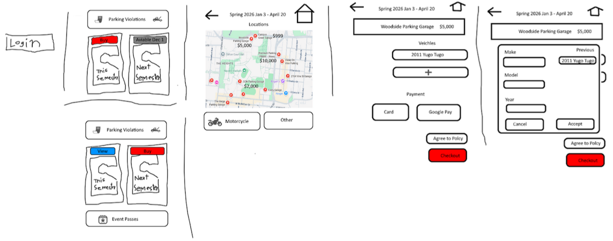
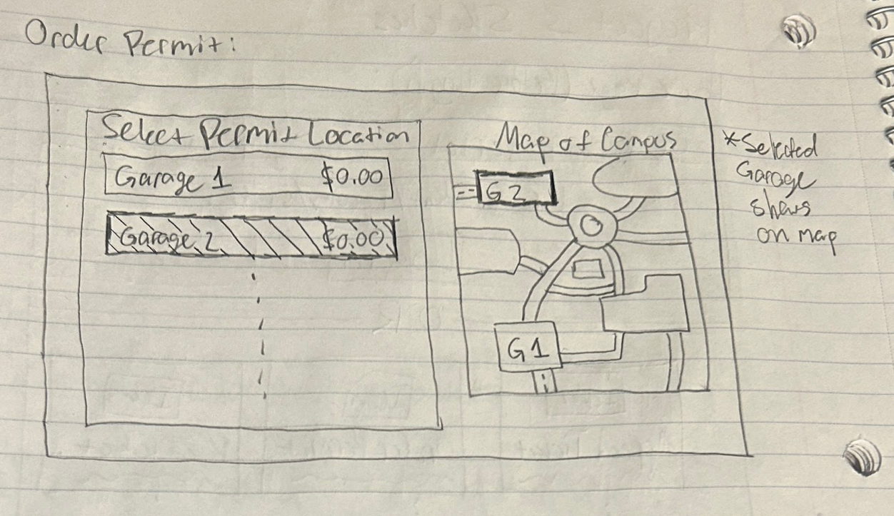
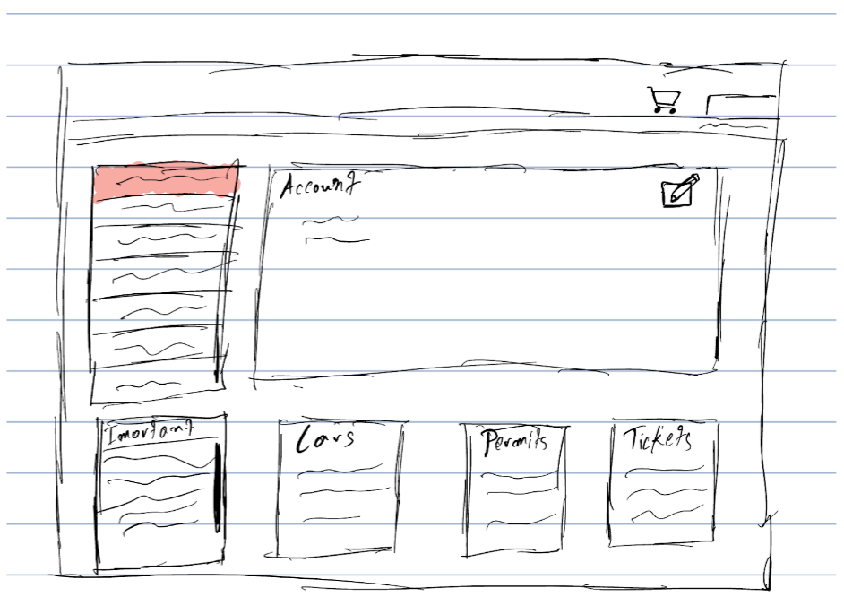
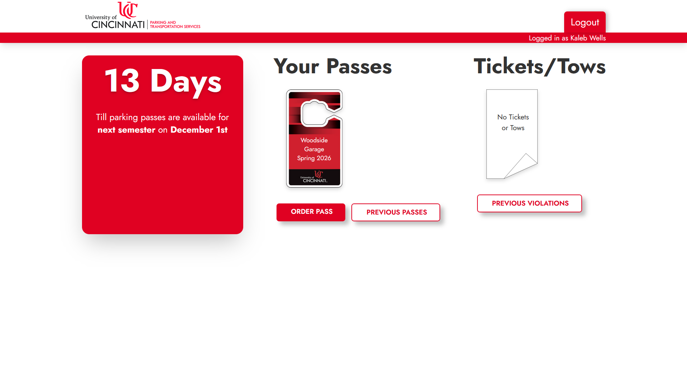
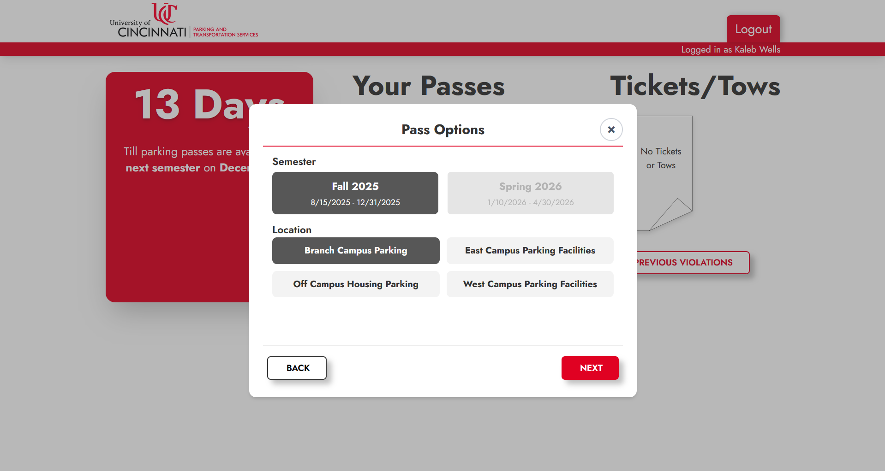
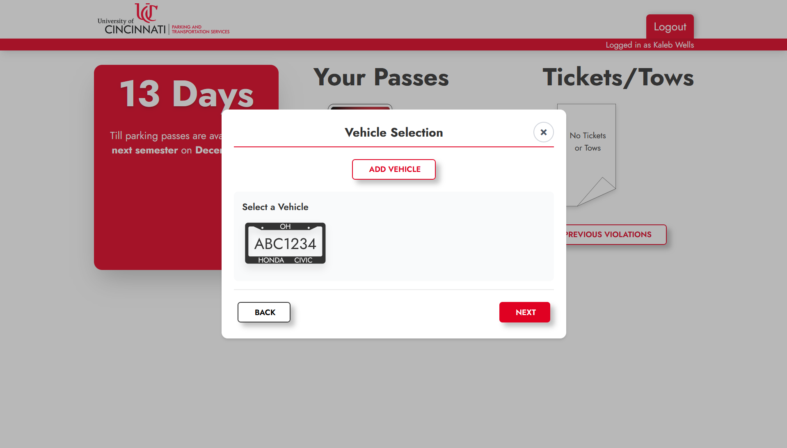
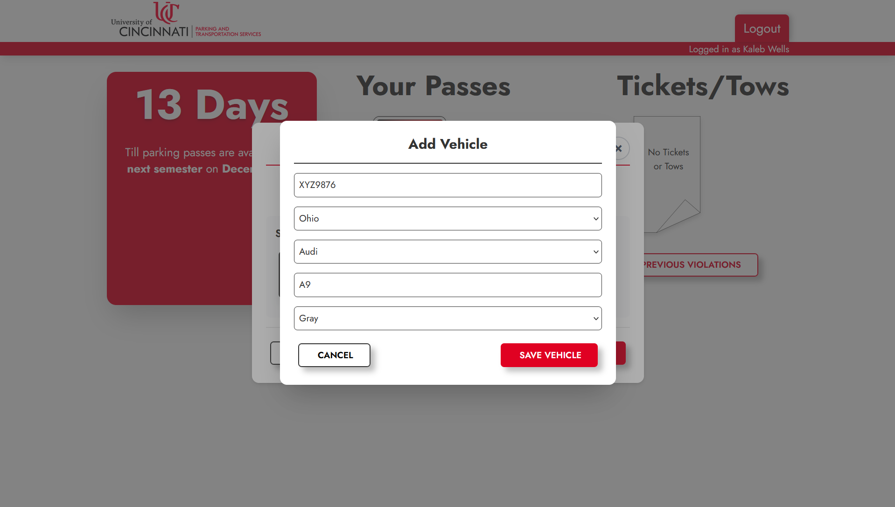
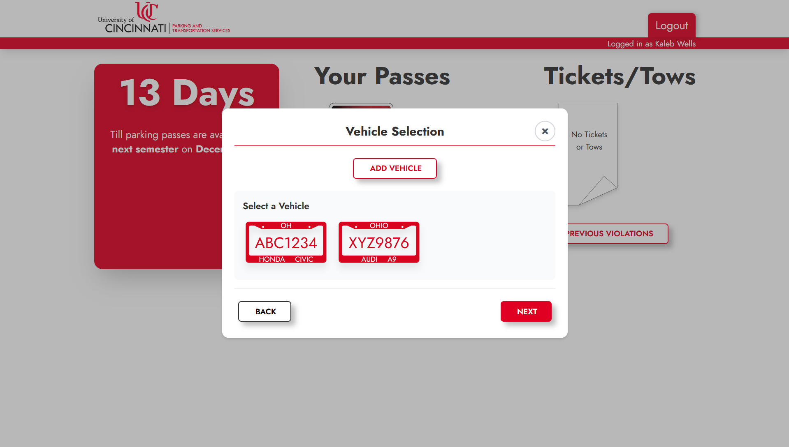
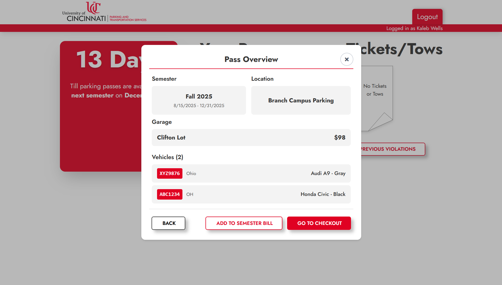
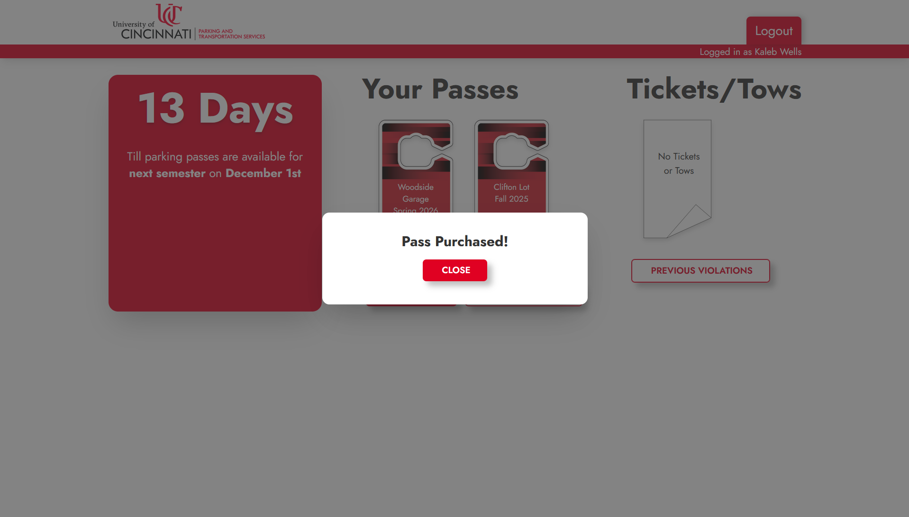

# UC Parking Redesign

A redesign of the widely-panned University of Cincinnati parking pass management UI.

## Design

Our research began with employing Nielsen's 10 Principles to identify pain points of the original application.
Some issues we identified were the following:

1. Visibility of System Status

There are many notable pieces of information, like what dates passes become available, that are hidden in text-heavy boxes at the bottom of the home page.
We aimed to consolidate this information and make it more immediately accessible.

2. Match Between System and the Real World

There exists some strange use of vocabulary in the original UI.
For instance, the term "parking permit" is used throughout the application, despite "parking pass" being a more well-known term.

3. Recognition Rather than Recall

In the original UI, there is no indication for where lots are located on campus, which requires users to recall information they may have never seen before.
There is no provided method for locating lots in the original application.
We aimed to provide a means for users to easily locate their intended parking location.

4. Aesthetic and Minimalist Design

The original UI contains an overabundance of buttons and options, many of which are redundant.
Its style is also unaligned with that of most official UC sites.
We aimed to unify the style with UC sites and consolidate the options.

### Sketches

We created a number of sketches for our redesign and gathered feedback.

1.

Those surveyed found this sketch difficult to understand but liked the menu structure.

2.

This sketch outlines a UI for a garage selection with a visual map. Those surveyed thought this would be a great feature.

3.

Those surveyed found this sketch clean and organized.

We formalized our designs in a [Canva document](https://www.canva.com/design/DAG4nWtO6kk/7Xgz269ZV1MA3ZsISA2Uvg/view?utm_content=DAG4nWtO6kk&utm_campaign=designshare&utm_medium=link2&utm_source=uniquelinks&utlId=hb77ff9bd99).

## App

On the home screen, the user is presented with three sections: a panel with important information,
a section containing the user's passes, and a section containing the user's parking violations.
The user can click the "Order Pass" button to begin a transaction.

Then, the user can select the semester to buy a pass for and the campus location.

Then, the user can select a garage to buy a pass for.
This screen includes a map of campus with garage locations marked.

Then, the user can select the vehicles to add to the pass. The user can also edit or add vehicles.

Then, a pass overview screen is shown before confirming the payment.

After checking out, a confirmation screen is shown and the pass is added.

## Implementation

This app was implemented in Svelte and SvelteKit. The order menu is implemented as a series of "step" components that modify a global order state. Persistent state is managed using localStorage.

The interactive map was added using the [Leaflet](https://leafletjs.com/) library.

## Future Work

There are a number of features in the app left unimplemented. Some of these include:

- Accounts and authentication
- Previous passes
- Parking violation management
- Payment
- Add to semester bill

Another feature that could be added in the future is a tool to pick a garage based on your class schedule.

## Demonstration

A demonstration video can be found [here](https://youtu.be/nWFpAF912-U).
